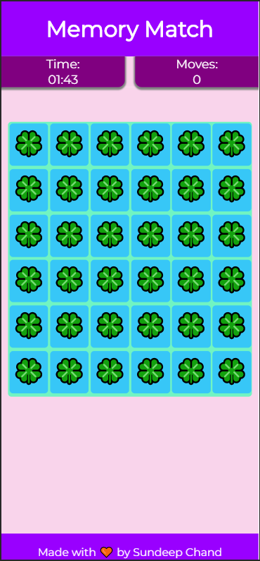

# Memory-Match
-----------------

> Play it [here!](https://sundeepchand.github.io/Memory-Match/)

A web-based memory game where the player selects cards having same pictures in a row to score the maximum points in minimum time possible.

## Uses HTML, CSS and Vanilla JS

## Screenshot

